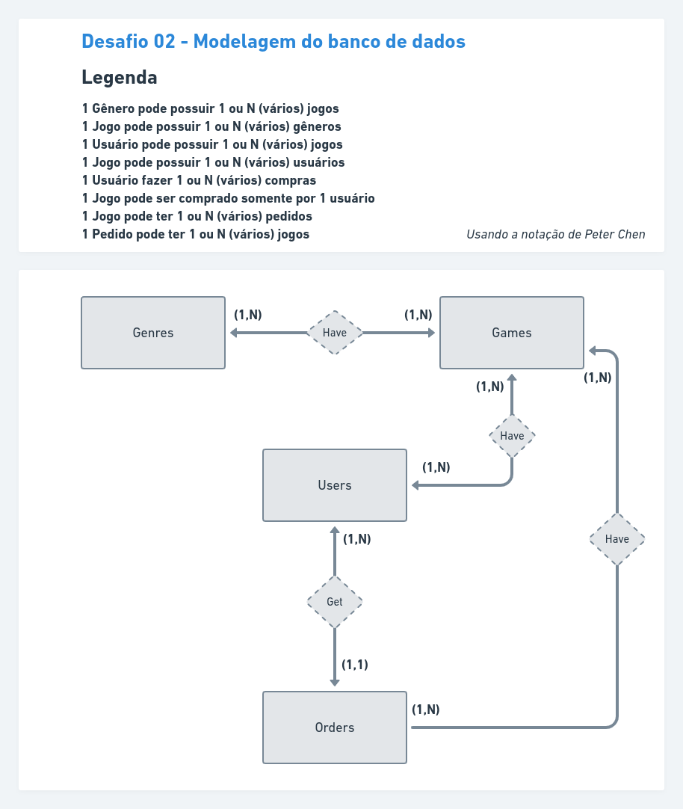

# Desafio 02 - Modelagem do banco de dados

Resolvendo um desafio do módulo III do curso Ignite NodeJS

## Modelagem

Aplicando o conceito de modelagem criado por Peter Chen, tem como característica o estudo da fase de dados conceitual do ciclo de vida de um banco de dados.
Cardinalidade
